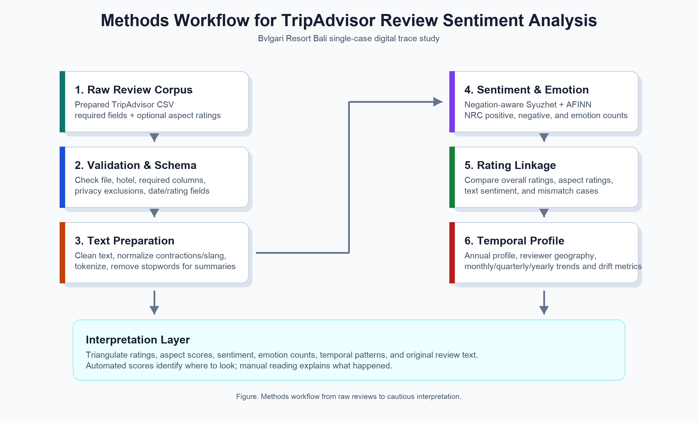

# Methods: TripAdvisor Review Sentiment Analysis for Bvlgari Resort Bali

## Methods

This study employs a mixed-methods digital trace research design that integrates quantitative analysis of TripAdvisor ratings with qualitative interpretation of guest review narratives. The quantitative component uses review counts, star ratings, structured aspect ratings, lexicon-based sentiment scores, and emotion-category counts. The qualitative component remains anchored in the original guest text, especially when ratings and textual sentiment diverge. This design follows the logic of review-based tourism sentiment studies in which numerical indicators are treated as structured summaries of user-generated narratives rather than replacements for contextual reading (Adnyana et al., 2026; Liu, 2020).

The empirical focus is Bvlgari Resort Bali, a single luxury resort case. The case was selected purposively because luxury-resort evaluations depend on service quality, image, value perception, room and villa quality, food and beverage experience, privacy, aesthetics, and other intangible experience attributes. These dimensions are suitable for review-based analysis because guests often describe them in narrative form, while hospitality research links service quality, satisfaction, image, loyalty, and revisit behavior to business-relevant guest outcomes (Bichler et al., 2021; Kandampully & Suhartanto, 2000). A single-case design also preserves property-specific context, which is important because TripAdvisor reviews can be shaped by platform trust, reviewer behavior, and cultural differences in review expression (Filieri et al., 2015; Litvin, 2019).

The study uses a prepared TripAdvisor review CSV located at `data/raw/reviews.csv`. The import procedure validates that the file exists, contains rows, includes non-empty review text, and contains the minimum required columns: `review_id`, `hotel_name`, `title`, `review_text`, `rating`, `review_date`, `stay_date`, and `trip_type`. The current corpus contains 762 reviews for Bvlgari Resort Bali, with review dates from October 2006 to May 18, 2026 and stay dates from September 2006 to May 2026. Rather than drawing a subsample, the workflow analyzes all available reviews in the prepared single-property corpus. This population-style approach is appropriate because the purpose is to characterize the available digital trace record for one hotel, not to estimate population parameters for all luxury-resort guests.

The dataset includes narrative fields, rating fields, time fields, and limited reviewer-context fields. Narrative fields include review titles and review text. Rating fields include the overall TripAdvisor star rating and optional aspect ratings for value, rooms, location, cleanliness, service, and sleep quality. Time fields include review date and stay date. Reviewer context is limited to aggregate-use fields such as `reviewer_location`, `reviewer_contributions`, and `trip_type`. Direct reviewer names, profile identifiers, and profile URLs are excluded from the analysis outputs because the project does not require person-level disclosure.

Data processing was conducted through a staged R workflow. First, `01_data_import.R` validates the raw dataset and confirms that the corpus is appropriate for the focal property. Second, `02_cleaning.R` standardizes fields, cleans review text, tokenizes reviews, and removes stopwords for token-level summaries. Third, `03_sentiment_analysis.R` calculates Syuzhet, AFINN, and NRC emotion outputs. Fourth, `04_visualization.R` generates descriptive and temporal figures. Fifth, `05_aspect_text_analysis.R` links structured aspect ratings to review text by comparing low-aspect and high-aspect reviews. Shared path and helper logic is centralized in `scripts/data_config.R` and `scripts/helpers.R` so that data import, cleaning, scoring, and visualization use consistent definitions.

| Stage | Procedure | Main output |
|---|---|---|
| Data validation | Check file existence, required fields, focal hotel name, review text, and privacy-related exclusions. | Validated raw review corpus. |
| Text preparation | Lowercase text, remove HTML, remove URLs, standardize Unicode punctuation, normalize selected informal expressions, tokenize words, and remove stopwords for token summaries. | Cleaned review text and token table. |
| Sentiment scoring | Apply negation-aware Syuzhet and AFINN scoring to each cleaned review. | Review-level sentiment scores and sentiment labels. |
| Emotion extraction | Apply NRC emotion categories to identify positive, negative, and basic emotion word counts. | Review-level emotion-count columns. |
| Rating comparison | Compare text sentiment with overall rating and aspect ratings. | Rating-sentiment charts, aspect summaries, and mismatch tables. |
| Temporal profiling | Aggregate review count, rating, sentiment, and reviewer location by month, quarter, and year. | Annual profile, period summaries, heatmaps, and rolling trends. |

Text preprocessing is intentionally transparent. Review text is converted to lowercase, HTML and URLs are removed, accented letters and Unicode punctuation are standardized where possible, punctuation and digits are removed, and repeated spaces are collapsed. A conservative slang-normalization dictionary handles a small set of informal expressions such as elongated positive words and common abbreviations. Contractions are standardized before scoring so that expressions such as "don't recommend" preserve the negation signal. The cleaned text is then tokenized with tidy text principles so that words, reviews, and scores can be inspected in tabular form (Silge & Robinson, 2016).

The sentiment procedure uses lexicon-based methods because they are transparent, reproducible, and explainable to non-technical readers. Syuzhet and AFINN scores are calculated with a local negation adjustment that reverses sentiment-bearing words appearing shortly after simple negators such as `not`, `never`, `without`, and `cannot`. AFINN assigns integer valence values to sentiment-bearing words (Nielsen, 2011). NRC analysis identifies positive and negative words as well as anger, anticipation, disgust, fear, joy, sadness, surprise, and trust categories (Mohammad & Turney, 2013). The study retains continuous scores because a simple positive, neutral, or negative label can hide differences in sentiment intensity.

The workflow accounts for review length when comparing periods and aspect groups. Summed lexicon scores can increase simply because a review is longer and contains more evaluative words. For this reason, temporal charts and aspect-text diagnostic summaries use sentiment scores scaled to the dataset's median cleaned review length. In the current corpus, the median cleaned review length is 112 words. This normalization does not remove all measurement limitations, but it reduces the risk that long reviews dominate period-level or aspect-level averages only because of their length.

Structured aspect ratings are treated as weak review-level labels. The analysis compares low-aspect reviews with high-aspect reviews for value, rooms, location, cleanliness, service, and sleep quality. This produces aspect-level summaries, key-term tables, key-phrase tables, mismatch tables, and qualitative examples. These outputs are not interpreted as causal proof. They identify where structured ratings and text signals converge or diverge, which then guides manual reading of the original review narratives.

Temporal, geographical, and rating profiling is conducted through an annual review profile. Each year is summarized by review count, reviewer locations with at least two reviews, average rating, and the distribution of five-star through one-star reviews. Missing reviewer locations are labeled `Unknown`. The reviewer-location field is used only for aggregate profiling because it is self-reported and incomplete. This annual profile follows the logic of the attached TripAdvisor sentiment study, where temporal coverage, reviewer geography, and rating distribution are presented together before more detailed sentiment interpretation (Adnyana et al., 2026).

Several safeguards support reliability and validity. Reliability is supported by scripted preprocessing, centralized configuration, deterministic cleaning rules, and saved intermediate outputs. Construct validity is strengthened by triangulating across overall ratings, aspect ratings, Syuzhet sentiment, AFINN sentiment, NRC emotion counts, temporal patterns, and original review text. Internal validation comes from checking whether these signals move together or diverge. Divergence is not treated as an error; it is treated as an analytical finding that requires qualitative interpretation.

The method has important limitations. TripAdvisor reviewers are self-selected and may not represent all guests. Review dates may differ from stay dates. The review platform, user interface, and reviewer population changed over the twenty-year review window. Lexicon-based sentiment can misread sarcasm, idioms, multilingual expressions, cultural context, luxury-hospitality vocabulary, and domain-specific meanings (Liu, 2020). Aspect ratings apply to entire reviews rather than individual sentences, so aspect-text associations should not be described as sentence-level proof. Finally, sentiment evidence can identify demand-side experience signals, but investment decisions would require financial and operational data that are not present in the review corpus.

Ethically, the analysis reports aggregate patterns and avoids unnecessary person-level disclosure. Public availability of online reviews does not remove the responsibility to handle guest narratives carefully. The workflow therefore removes direct reviewer identifiers from tracked analysis outputs, retains reviewer location only for aggregate geographic summaries, and treats automated sentiment scores as supporting evidence rather than final judgments about individual reviewers or staff members.

## References

Adnyana, P. P., Wiweka, K., Lochan, A., & Trisdyani, N. L. P. (2026). Beyond taste: A sentiment analysis of informal language and cultural appreciation in Tripadvisor reviews of Balinese Ayam Betutu. *SOSIOHUMANIORA: Jurnal Ilmiah Ilmu Sosial dan Humaniora, 12*(1), 176-197. https://doi.org/10.30738/sosio.v12i1.21041

Bichler, B. F., Pikkemaat, B., & Peters, M. (2021). Exploring the role of service quality, atmosphere and food for revisits in restaurants by using a e-mystery guest approach. *Journal of Hospitality and Tourism Insights, 4*(3), 351-369. https://doi.org/10.1108/JHTI-04-2020-0048

Filieri, R., Alguezaui, S., & McLeay, F. (2015). Why do travelers trust TripAdvisor? Antecedents of trust towards consumer-generated media and its influence on recommendation adoption and word of mouth. *Tourism Management, 51*, 174-185. https://doi.org/10.1016/j.tourman.2015.05.007

Kandampully, J., & Suhartanto, D. (2000). Customer loyalty in the hotel industry: The role of customer satisfaction and image. *International Journal of Contemporary Hospitality Management, 12*(6), 346-351. https://doi.org/10.1108/09596110010342559

Litvin, S. W. (2019). Hofstede, cultural differences, and TripAdvisor hotel reviews. *International Journal of Tourism Research, 21*(5), 712-717. https://doi.org/10.1002/jtr.2298

Liu, B. (2020). *Sentiment analysis: Mining opinions, sentiments, and emotions* (2nd ed.). Cambridge University Press. https://doi.org/10.1017/9781108639286

Mohammad, S. M., & Turney, P. D. (2013). *NRC Emotion Lexicon*. National Research Council Canada. https://doi.org/10.4224/21270984

Nielsen, F. A. (2011). A new ANEW: Evaluation of a word list for sentiment analysis in microblogs. *Proceedings of the ESWC2011 Workshop on Making Sense of Microposts*, 93-98. https://doi.org/10.48550/arXiv.1103.2903

Silge, J., & Robinson, D. (2016). tidytext: Text mining and analysis using tidy data principles in R. *Journal of Open Source Software, 1*(3), 37. https://doi.org/10.21105/joss.00037
