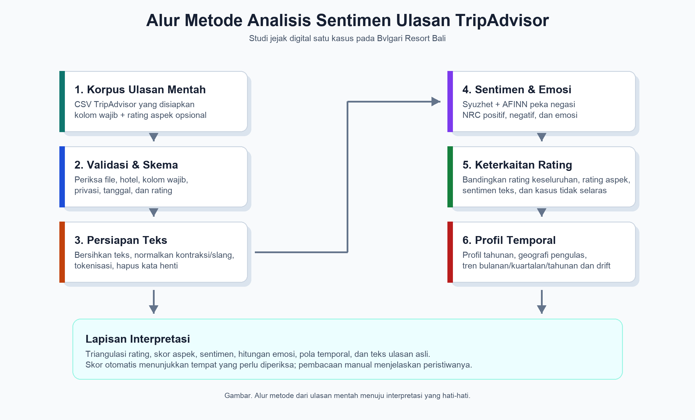

# Metode: Analisis Sentimen Ulasan TripAdvisor untuk Bvlgari Resort Bali

## Metode

Penelitian ini menggunakan rancangan metode campuran berbasis jejak digital. Rancangan tersebut menggabungkan analisis kuantitatif terhadap rating TripAdvisor dengan pembacaan kualitatif atas narasi ulasan tamu. Komponen kuantitatif mencakup jumlah ulasan, rating bintang, rating aspek terstruktur, skor sentimen berbasis leksikon, dan hitungan kategori emosi. Komponen kualitatif tetap bertumpu pada teks ulasan asli, terutama ketika rating numerik dan sentimen tekstual tidak sejalan. Pendekatan ini mengikuti logika studi sentimen pariwisata berbasis ulasan, yaitu indikator numerik dipakai sebagai ringkasan terstruktur dari narasi pengguna, bukan sebagai pengganti pembacaan kontekstual (Adnyana et al., 2026; Liu, 2020).

Fokus empiris penelitian adalah Bvlgari Resort Bali sebagai satu kasus resor mewah. Kasus ini dipilih secara purposif karena penilaian terhadap resor mewah sangat bergantung pada kualitas layanan, citra, persepsi nilai, kualitas kamar dan vila, pengalaman makanan dan minuman, privasi, estetika, dan atribut pengalaman tidak berwujud lainnya. Dimensi-dimensi tersebut cocok dianalisis melalui ulasan karena tamu sering menjelaskannya secara naratif, sedangkan penelitian perhotelan mengaitkan kualitas layanan, kepuasan, citra, loyalitas, dan niat berkunjung kembali dengan hasil yang relevan secara bisnis (Bichler et al., 2021; Kandampully & Suhartanto, 2000). Rancangan satu kasus juga menjaga konteks khusus properti, yang penting karena ulasan TripAdvisor dapat dipengaruhi oleh kepercayaan terhadap platform, perilaku pengulas, dan perbedaan budaya dalam mengekspresikan pengalaman (Filieri et al., 2015; Litvin, 2019).

Penelitian ini menggunakan CSV ulasan TripAdvisor yang telah disiapkan pada `data/raw/reviews.csv`. Prosedur impor memvalidasi bahwa file tersedia, berisi baris data, memuat teks ulasan yang tidak kosong, dan memiliki kolom minimum yang diperlukan: `review_id`, `hotel_name`, `title`, `review_text`, `rating`, `review_date`, `stay_date`, dan `trip_type`. Korpus saat ini berisi 762 ulasan untuk Bvlgari Resort Bali, dengan tanggal ulasan dari Oktober 2006 sampai 18 Mei 2026 dan tanggal menginap dari September 2006 sampai Mei 2026. Alih-alih mengambil subsampel, alur kerja menganalisis seluruh ulasan yang tersedia dalam korpus satu properti tersebut. Pendekatan seluruh populasi ini sesuai karena tujuan penelitian adalah menggambarkan catatan jejak digital yang tersedia untuk satu hotel, bukan menaksir parameter populasi untuk seluruh tamu resor mewah.

Dataset mencakup bidang naratif, bidang rating, bidang waktu, dan bidang konteks pengulas yang terbatas. Bidang naratif meliputi judul ulasan dan teks ulasan. Bidang rating mencakup rating bintang TripAdvisor secara keseluruhan serta rating aspek opsional untuk nilai, kamar, lokasi, kebersihan, layanan, dan kualitas tidur. Bidang waktu mencakup tanggal ulasan dan tanggal menginap. Konteks pengulas dibatasi pada bidang yang digunakan secara agregat, seperti `reviewer_location`, `reviewer_contributions`, dan `trip_type`. Nama pengulas, pengenal profil, dan URL profil dikeluarkan dari output analisis karena proyek ini tidak memerlukan pengungkapan pada tingkat individu.

Pengolahan data dilakukan melalui alur kerja R bertahap. Pertama, `01_data_import.R` memvalidasi dataset mentah dan memastikan bahwa korpus sesuai untuk properti fokus. Kedua, `02_cleaning.R` menstandarkan bidang data, membersihkan teks ulasan, melakukan tokenisasi, dan menghapus kata henti untuk ringkasan tingkat token. Ketiga, `03_sentiment_analysis.R` menghitung keluaran Syuzhet, AFINN, dan emosi NRC. Keempat, `04_visualization.R` menghasilkan gambar deskriptif dan temporal. Kelima, `05_aspect_text_analysis.R` menghubungkan rating aspek terstruktur dengan teks ulasan melalui perbandingan antara ulasan beraspek rendah dan beraspek tinggi. Logika jalur file dan fungsi bantu dipusatkan di `scripts/data_config.R` dan `scripts/helpers.R` agar impor data, pembersihan, penskoran, dan visualisasi menggunakan definisi yang konsisten.

| Tahap | Prosedur | Output utama |
|---|---|---|
| Validasi data | Memeriksa keberadaan file, kolom wajib, nama hotel fokus, teks ulasan, dan pengecualian terkait privasi. | Korpus ulasan mentah yang tervalidasi. |
| Persiapan teks | Mengubah teks menjadi huruf kecil, menghapus HTML dan URL, menstandarkan tanda baca Unicode, menormalisasi ungkapan informal terpilih, melakukan tokenisasi, dan menghapus kata henti untuk ringkasan token. | Teks ulasan bersih dan tabel token. |
| Penskoran sentimen | Menerapkan penskoran Syuzhet dan AFINN yang peka terhadap negasi pada setiap ulasan bersih. | Skor sentimen dan label sentimen tingkat ulasan. |
| Ekstraksi emosi | Menerapkan kategori emosi NRC untuk mengidentifikasi hitungan kata positif, negatif, dan emosi dasar. | Kolom hitungan emosi tingkat ulasan. |
| Perbandingan rating | Membandingkan sentimen teks dengan rating keseluruhan dan rating aspek. | Grafik rating-sentimen, ringkasan aspek, dan tabel ketidaksesuaian. |
| Profil temporal | Mengagregasi jumlah ulasan, rating, sentimen, dan lokasi pengulas menurut bulan, kuartal, dan tahun. | Profil tahunan, ringkasan periode, heatmap, dan tren bergulir. |

Prapemrosesan teks dibuat transparan. Teks ulasan diubah menjadi huruf kecil, HTML dan URL dihapus, huruf beraksen dan tanda baca Unicode distandarkan sejauh memungkinkan, tanda baca dan angka dihapus, dan spasi berulang diringkas. Kamus normalisasi slang yang konservatif menangani sejumlah kecil ungkapan informal, seperti kata positif yang dipanjangkan dan singkatan umum. Kontraksi distandarkan sebelum penskoran agar ungkapan seperti "don't recommend" tetap mempertahankan sinyal negasi. Teks bersih kemudian ditokenisasi berdasarkan prinsip tidy text sehingga kata, ulasan, dan skor dapat diperiksa dalam bentuk tabel (Silge & Robinson, 2016).

Prosedur sentimen menggunakan metode berbasis leksikon karena bersifat transparan, dapat direproduksi, dan dapat dijelaskan kepada pembaca non-teknis. Skor Syuzhet dan AFINN dihitung dengan penyesuaian negasi lokal yang membalik nilai kata bersentimen ketika kata tersebut muncul tidak lama setelah penanda negasi sederhana seperti `not`, `never`, `without`, dan `cannot`. AFINN memberikan nilai valensi bilangan bulat pada kata yang mengandung sentimen (Nielsen, 2011). Analisis NRC mengidentifikasi kata positif dan negatif serta kategori anger, anticipation, disgust, fear, joy, sadness, surprise, dan trust (Mohammad & Turney, 2013). Penelitian ini mempertahankan skor kontinu karena label positif, netral, atau negatif yang sederhana dapat menyembunyikan perbedaan intensitas sentimen.

Alur kerja memperhitungkan panjang ulasan ketika membandingkan periode dan kelompok aspek. Skor leksikon yang dijumlahkan dapat meningkat hanya karena sebuah ulasan lebih panjang dan memuat lebih banyak kata evaluatif. Oleh sebab itu, grafik temporal dan ringkasan diagnostik aspek-teks menggunakan skor sentimen yang diskalakan terhadap panjang ulasan bersih median dalam dataset. Pada korpus saat ini, panjang median ulasan bersih adalah 112 kata. Normalisasi ini tidak menghilangkan seluruh keterbatasan pengukuran, tetapi mengurangi risiko bahwa ulasan panjang mendominasi rata-rata periode atau aspek hanya karena panjangnya.

Rating aspek terstruktur diperlakukan sebagai label lemah pada tingkat ulasan. Analisis membandingkan ulasan beraspek rendah dengan ulasan beraspek tinggi untuk nilai, kamar, lokasi, kebersihan, layanan, dan kualitas tidur. Perbandingan ini menghasilkan ringkasan aspek, tabel kata kunci, tabel frasa kunci, tabel ketidaksesuaian, dan contoh kualitatif. Output tersebut tidak ditafsirkan sebagai bukti kausal. Output hanya menunjukkan tempat sinyal rating terstruktur dan sinyal teks bertemu atau menyimpang, lalu mengarahkan pembacaan manual terhadap narasi ulasan asli.

Profil temporal, geografis, dan rating dilakukan melalui profil ulasan tahunan. Setiap tahun diringkas menurut jumlah ulasan, lokasi pengulas dengan sedikitnya dua ulasan, rating rata-rata, dan distribusi ulasan bintang lima sampai bintang satu. Lokasi pengulas yang hilang diberi label `Unknown`. Bidang lokasi pengulas hanya digunakan untuk profil agregat karena bersifat swadeklaratif dan tidak lengkap. Profil tahunan ini mengikuti logika studi sentimen TripAdvisor yang menjadi acuan, yaitu cakupan temporal, geografi pengulas, dan distribusi rating disajikan bersama sebelum interpretasi sentimen yang lebih rinci (Adnyana et al., 2026).

Beberapa langkah menjaga reliabilitas dan validitas. Reliabilitas didukung oleh prapemrosesan berbasis skrip, konfigurasi terpusat, aturan pembersihan deterministik, dan output antara yang disimpan. Validitas konstruk diperkuat melalui triangulasi antara rating keseluruhan, rating aspek, sentimen Syuzhet, sentimen AFINN, hitungan emosi NRC, pola temporal, dan teks ulasan asli. Validasi internal dilakukan dengan memeriksa apakah sinyal-sinyal tersebut bergerak searah atau menyimpang. Penyimpangan tidak diperlakukan sebagai kesalahan, melainkan sebagai temuan analitis yang memerlukan interpretasi kualitatif.

Metode ini memiliki beberapa keterbatasan penting. Pengulas TripAdvisor bersifat self-selected dan mungkin tidak mewakili seluruh tamu. Tanggal ulasan dapat berbeda dari tanggal menginap. Platform, antarmuka pengguna, dan populasi pengulas berubah selama rentang ulasan hampir dua puluh tahun. Sentimen berbasis leksikon dapat keliru membaca sarkasme, idiom, ungkapan multibahasa, konteks budaya, kosakata perhotelan mewah, dan makna yang bergantung pada domain (Liu, 2020). Rating aspek berlaku untuk seluruh ulasan, bukan untuk kalimat tertentu, sehingga asosiasi aspek-teks tidak boleh dijelaskan sebagai bukti pada tingkat kalimat. Terakhir, bukti sentimen dapat mengidentifikasi sinyal pengalaman dari sisi permintaan, tetapi keputusan investasi memerlukan data keuangan dan operasional yang tidak terdapat dalam korpus ulasan.

Secara etis, analisis ini melaporkan pola agregat dan menghindari pengungkapan individu yang tidak perlu. Ketersediaan ulasan secara publik tidak menghapus tanggung jawab untuk menangani narasi tamu secara hati-hati. Karena itu, alur kerja menghapus pengenal pengulas langsung dari output analisis yang dilacak, mempertahankan lokasi pengulas hanya untuk ringkasan geografis agregat, dan memperlakukan skor sentimen otomatis sebagai bukti pendukung, bukan sebagai penilaian akhir terhadap pengulas atau staf tertentu.

## Referensi

Adnyana, P. P., Wiweka, K., Lochan, A., & Trisdyani, N. L. P. (2026). Beyond taste: A sentiment analysis of informal language and cultural appreciation in Tripadvisor reviews of Balinese Ayam Betutu. *SOSIOHUMANIORA: Jurnal Ilmiah Ilmu Sosial dan Humaniora, 12*(1), 176-197. https://doi.org/10.30738/sosio.v12i1.21041

Bichler, B. F., Pikkemaat, B., & Peters, M. (2021). Exploring the role of service quality, atmosphere and food for revisits in restaurants by using a e-mystery guest approach. *Journal of Hospitality and Tourism Insights, 4*(3), 351-369. https://doi.org/10.1108/JHTI-04-2020-0048

Filieri, R., Alguezaui, S., & McLeay, F. (2015). Why do travelers trust TripAdvisor? Antecedents of trust towards consumer-generated media and its influence on recommendation adoption and word of mouth. *Tourism Management, 51*, 174-185. https://doi.org/10.1016/j.tourman.2015.05.007

Kandampully, J., & Suhartanto, D. (2000). Customer loyalty in the hotel industry: The role of customer satisfaction and image. *International Journal of Contemporary Hospitality Management, 12*(6), 346-351. https://doi.org/10.1108/09596110010342559

Litvin, S. W. (2019). Hofstede, cultural differences, and TripAdvisor hotel reviews. *International Journal of Tourism Research, 21*(5), 712-717. https://doi.org/10.1002/jtr.2298

Liu, B. (2020). *Sentiment analysis: Mining opinions, sentiments, and emotions* (2nd ed.). Cambridge University Press. https://doi.org/10.1017/9781108639286

Mohammad, S. M., & Turney, P. D. (2013). *NRC Emotion Lexicon*. National Research Council Canada. https://doi.org/10.4224/21270984

Nielsen, F. A. (2011). A new ANEW: Evaluation of a word list for sentiment analysis in microblogs. *Proceedings of the ESWC2011 Workshop on Making Sense of Microposts*, 93-98. https://doi.org/10.48550/arXiv.1103.2903

Silge, J., & Robinson, D. (2016). tidytext: Text mining and analysis using tidy data principles in R. *Journal of Open Source Software, 1*(3), 37. https://doi.org/10.21105/joss.00037
