# Laporan Analisis Ulasan TripAdvisor untuk Bvlgari Resort Bali: Data, Metode, Hasil, dan Arah Pengembangan

## Abstrak

Laporan ini menyajikan kerangka analisis yang dapat direproduksi untuk mengubah ulasan TripAdvisor menjadi bukti terstruktur mengenai pengalaman tamu Bvlgari Resort Bali. Proyek menggunakan korpus ulasan TripAdvisor yang telah disiapkan dan menjalankan alur kerja R bertahap: validasi data, pembersihan teks, penskoran sentimen berbasis leksikon, ekstraksi emosi, analisis rating aspek, profil tahunan, visualisasi temporal, dan pemantauan drift statistik. Desain penelitian memakai pendekatan studi kasus tunggal berbasis jejak digital: satu resor mewah diperlakukan sebagai kasus terikat, sedangkan ulasan publik diperlakukan sebagai rekaman electronic word of mouth mengenai pengalaman tamu (Filieri et al., 2015; Litvin, 2019).

Dataset analitis akhir berisi 762 ulasan TripAdvisor dari Oktober 2006 sampai Mei 2026. Dataset mencakup rating bintang, tanggal ulasan, tanggal menginap, lokasi pengulas, jumlah kontribusi pengulas, rating aspek opsional, teks ulasan yang telah dibersihkan, skor Syuzhet yang disesuaikan terhadap negasi, skor AFINN yang disesuaikan terhadap negasi, dan skor emosi NRC. Kerangka ini tidak hanya mengklasifikasikan ulasan sebagai positif atau negatif, tetapi juga membandingkan rating numerik, sentimen teks, emosi, aspek pengalaman, geografi pengulas, dan pola waktu.

Kerangka yang diimplementasikan saat ini bersifat analitis, bukan preskriptif. Kode dapat menunjukkan pola sentimen, rating, dan aspek yang perlu dibaca lebih lanjut, tetapi belum menetapkan rekomendasi manajemen atau keputusan investasi otomatis. Bagian pengembangan masa depan menjelaskan bagaimana output ini dapat diperluas menjadi sistem peringatan dini berbasis drift rating dan sentimen. Keterbatasan utama penelitian adalah bias self-selection pengulas TripAdvisor, ketidaksempurnaan sentimen berbasis leksikon, perubahan platform selama periode panjang, dan tidak tersedianya data keuangan atau operasional untuk mendukung keputusan investasi.

Kata kunci: TripAdvisor, analisis sentimen, ulasan hotel, resor mewah, Bvlgari Resort Bali, electronic word of mouth, AFINN, Syuzhet, NRC Emotion Lexicon, kualitas layanan, profil ulasan tahunan, analisis temporal.

## 1. Pendahuluan

Ulasan daring menjadi sumber bukti penting dalam penelitian pariwisata dan perhotelan karena mencatat evaluasi tamu dalam lingkungan digital alami dan dapat memengaruhi kepercayaan wisatawan, adopsi rekomendasi, serta word of mouth (Filieri et al., 2015). Pada hotel mewah, ulasan memiliki nilai khusus karena kepuasan tamu tidak hanya dipengaruhi oleh kualitas fungsional, tetapi juga oleh pengalaman emosional, eksklusivitas, nilai yang dirasakan, personalisasi, estetika, privasi, dan pemulihan layanan. Penelitian perhotelan juga menekankan hubungan antara kualitas layanan, citra, kepuasan, loyalitas, dan perilaku tamu (Kandampully & Suhartanto, 2000).

Analisis rating saja tidak cukup. Sebuah properti dapat mempertahankan rating rata-rata tinggi sambil tetap mengumpulkan tanda-tanda ketidakpuasan dalam teks, misalnya mengenai nilai, pemeliharaan vila, makanan, koordinasi staf, atau perbedaan ekspektasi. Sebaliknya, tamu dapat memberi rating sedang tetapi menulis komentar positif mengenai aspek tertentu. Karena itu, penelitian ini menggabungkan rating numerik dengan teks ulasan.

Metode proyek terinspirasi oleh studi sentimen TripAdvisor pada kuliner Bali yang menggabungkan korpus digital, pembersihan teks, metode leksikon, interpretasi temporal, dan pembacaan kualitatif (Adnyana et al., 2026; Liu, 2020). Dalam proyek ini, pendekatan tersebut diterapkan pada kasus resor mewah tunggal.

## 2. Tujuan dan Objektif Metodologis

Tujuan penelitian adalah merancang dan mendokumentasikan metode analisis ulasan TripAdvisor untuk Bvlgari Resort Bali secara transparan dan dapat direproduksi. Alur kerja menghasilkan data bersih, skor sentimen, skor emosi, ringkasan rating, grafik, dan tabel diagnostik.

Objektif metodologisnya adalah:

1. Memvalidasi dan menstandarkan dataset ulasan TripAdvisor untuk satu hotel mewah.
2. Membersihkan teks ulasan agar sesuai untuk tokenisasi dan analisis sentimen berbasis leksikon.
3. Menghitung skor sentimen dengan Syuzhet, AFINN, dan kategori emosi NRC.
4. Membandingkan sentimen teks dengan rating bintang dan rating aspek.
5. Menyajikan profil temporal, geografis, rating, aspek, dan sentimen dalam bentuk tabel dan grafik.
6. Menyediakan dasar untuk pengembangan masa depan berupa pemantauan drift dan dukungan keputusan.

## 3. Desain Penelitian

Penelitian menggunakan desain studi kasus tunggal berbasis jejak digital. Bvlgari Resort Bali menjadi kasus fokus, sedangkan ulasan TripAdvisor diperlakukan sebagai jejak digital pengalaman tamu dan electronic word of mouth (Filieri et al., 2015). Fokus satu properti dipilih karena resor mewah sangat bergantung pada konteks spesifik: janji merek, lokasi, format vila, model layanan, pengalaman butler, makanan dan minuman, harga, dan ekspektasi tamu.

Penelitian juga menggunakan logika metode campuran. Komponen kuantitatif mencakup rating bintang, rating aspek, skor sentimen, hitungan emosi, jumlah ulasan, median, rata-rata, dan pola temporal. Komponen kualitatif tetap berada pada teks ulasan asli. Periode dengan skor rendah, ulasan outlier, dan ketidaksesuaian rating-sentimen harus dibaca secara manual agar konteksnya tidak hilang (Adnyana et al., 2026; Liu, 2020).

Alur kerja R terdiri dari beberapa skrip:

| Skrip | Peran metodologis |
|---|---|
| `01_data_import.R` | Memvalidasi file ulasan mentah dan kolom wajib. |
| `02_cleaning.R` | Menstandarkan kolom, membersihkan teks, tokenisasi, dan menghapus stopword. |
| `03_sentiment_analysis.R` | Menghitung skor Syuzhet, AFINN, kategori sentimen, dan emosi NRC. |
| `04_visualization.R` | Menghasilkan grafik sentimen, rating, aspek, geografi, dan temporal. |
| `05_aspect_text_analysis.R` | Menghubungkan rating aspek dengan sinyal teks dan contoh kualitatif. |
| `scripts/data_config.R` | Menyimpan jalur file dan metadata sumber secara terpusat. |
| `scripts/helpers.R` | Menyediakan fungsi bantu untuk pembersihan teks, normalisasi, dan penskoran. |

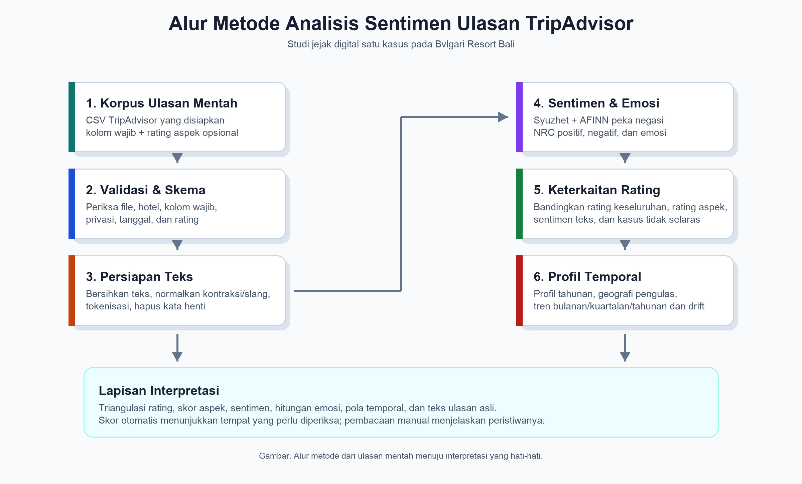

## 4. Sumber Data dan Konstruksi Korpus

Proyek menggunakan CSV ulasan TripAdvisor yang telah disiapkan pada `data/raw/reviews.csv`. Skrip impor memvalidasi bahwa file tersedia, berisi baris, memiliki teks ulasan yang tidak kosong, dan memuat kolom wajib: `review_id`, `hotel_name`, `title`, `review_text`, `rating`, `review_date`, `stay_date`, dan `trip_type`.

Dataset juga memuat kolom opsional yang digunakan ketika tersedia, termasuk `reviewer_location`, `reviewer_contributions`, `insider_tip`, `source`, dan enam rating aspek: value, rooms, location, cleanliness, service, dan sleep quality. Kolom `reviewer_location` digunakan hanya untuk profil geografis agregat. Nama pengulas, ID profil, dan URL profil tidak disimpan dalam output analisis.

Ringkasan korpus saat ini:

| Metrik | Nilai |
|---|---:|
| Total ulasan | 762 |
| Hotel | Bvlgari Resort Bali |
| Rentang tanggal ulasan | 2006-10-01 sampai 2026-05-18 |
| Rentang tanggal menginap | 2006-09-01 sampai 2026-05-01 |
| Rata-rata rating bintang | 4.56 |
| Median rating bintang | 5.00 |
| Ulasan 5 bintang | 596 |
| Ulasan 4 bintang | 77 |
| Ulasan 1-3 bintang | 89 |
| Label sentimen positif | 733 |
| Label sentimen netral | 2 |
| Label sentimen negatif | 27 |

Korpus sangat condong positif. Karena itu, analisis tidak boleh berhenti pada rata-rata rating atau jumlah label positif. Bagian berikutnya melihat rating rendah, rating aspek, sentimen teks, lokasi pengulas, dan pola waktu.

## 5. Profil Tahunan, Geografis, dan Rating

Profil tahunan menggabungkan waktu, geografi pengulas, dan distribusi rating. `output/reports/annual_review_profile.csv` menyajikan jumlah ulasan per tahun, negara pengulas dengan sedikitnya dua ulasan, rata-rata rating, dan distribusi rating bintang lima sampai satu. Negara pengulas berasal dari normalisasi `reviewer_location` ke `reviewer_country`, sehingga bentuk seperti `Singapore, Singapore` dan `Singapore` dihitung bersama. Geografi pengulas yang hilang diberi label `Unknown`, dan daftar negara per tahun dibatasi agar tabel tetap terbaca.

Volume ulasan tidak merata antar tahun. Periode 2016, 2017, 2018, dan bagian awal 2026 memiliki jumlah ulasan tinggi, sedangkan 2006 dan 2007 hanya memiliki sedikit ulasan. Tahun dengan volume rendah harus ditafsirkan hati-hati karena satu atau dua ulasan dapat mengubah rata-rata secara tajam. Distribusi rating juga sangat condong: 596 dari 762 ulasan adalah ulasan 5 bintang, sedangkan 89 ulasan berada pada rating 1 sampai 3.

Profil negara pengulas menunjukkan jangkauan internasional. United States, Australia, Indonesia, Singapore, China, United Kingdom, dan beberapa pasar lain muncul berulang kali. Namun, 178 ulasan tidak memiliki geografi pengulas. Karena lokasi bersifat self-reported dan tidak lengkap, geografi harus dibaca sebagai konteks mengenai pengulas yang terlihat dalam data, bukan sebagai distribusi asal pasar yang representatif.

Grafik berikut memperluas profil geografis dengan membandingkan sentimen median menurut negara pengulas. Grafik memakai skor AFINN yang dinormalisasi ke panjang ulasan median dan hanya menampilkan negara dengan sedikitnya lima ulasan. Median dipilih karena ukuran kelompok negara tidak seimbang dan satu ulasan ekstrem dapat memengaruhi mean secara berlebihan.

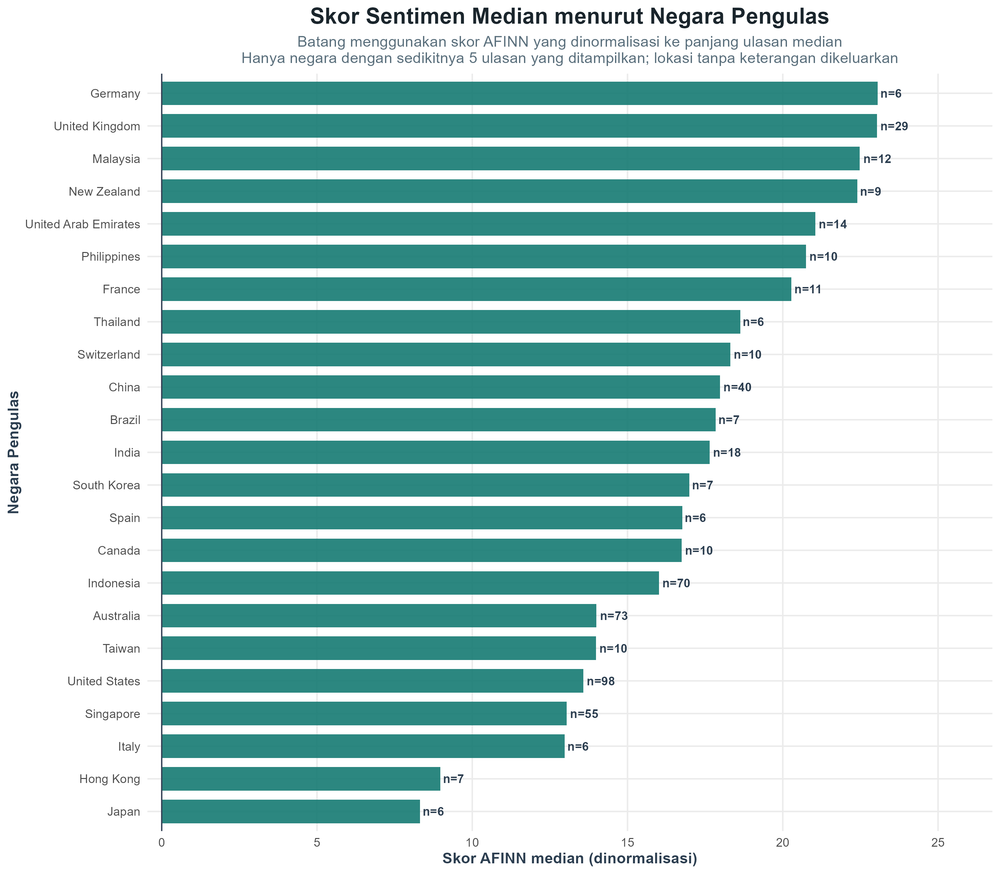

## 6. Validasi Data dan Prapemrosesan Teks

Tahap pertama adalah validasi. `01_data_import.R` memastikan bahwa file mentah tersedia, memiliki ukuran lebih dari nol, berisi kolom wajib, memuat teks ulasan, hanya menganalisis Bvlgari Resort Bali, dan tidak membawa pengenal langsung pengulas ke output analisis. Tahap ini mencegah skrip berikutnya menganalisis file yang salah, tidak lengkap, atau tidak sesuai privasi.

Tahap kedua adalah standardisasi skema. Fungsi `standardize_hotel_reviews()` memetakan nama kolom sumber ke struktur internal yang konsisten. Standardisasi ini penting karena ekspor ulasan dapat memakai nama kolom yang berbeda.

Pembersihan teks dilakukan melalui `clean_text()` di `scripts/helpers.R`. Proses ini mengubah teks menjadi huruf kecil, menghapus HTML, URL, tanda baca, angka, dan spasi berulang, serta menstandardisasi karakter Unicode sejauh memungkinkan. Fungsi `normalize_slang()` menangani sejumlah ungkapan informal secara konservatif, misalnya bentuk kata yang dipanjangkan dan singkatan umum. Setelah itu, teks ditokenisasi memakai `tidytext::unnest_tokens()`.

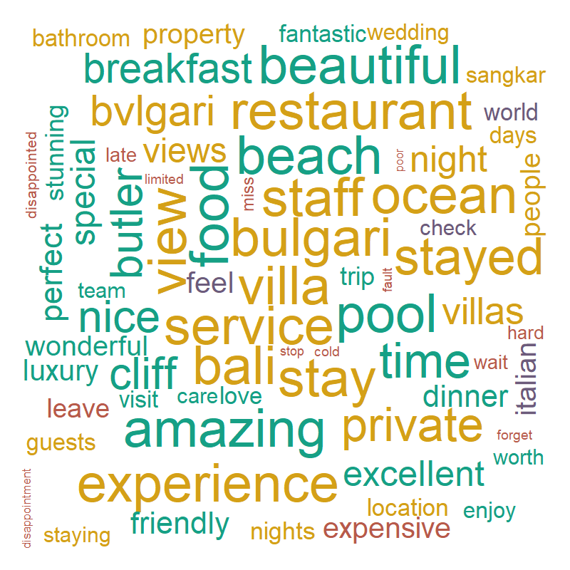

Dalam word cloud, kata hijau kebiruan menunjukkan bahasa positif atau emosional, kata emas menunjukkan topik pengalaman hotel, kata merah lembut menunjukkan istilah negatif atau keluhan, dan kata ungu menunjukkan konteks lain yang sering muncul.

## 7. Penskoran Sentimen dan Emosi

Analisis sentimen menggunakan metode berbasis leksikon karena transparan, dapat direproduksi, dan dapat dijelaskan kepada pembaca non-teknis. Skor Syuzhet dan AFINN dihitung dengan penyesuaian negasi sederhana. Jika kata bersentimen muncul setelah penanda seperti `not`, `never`, `without`, atau `cannot`, nilai sentimennya dibalik. Hal ini mencegah frasa seperti "cannot recommend" diperlakukan sebagai positif hanya karena kata "recommend" bernilai positif.

AFINN memberikan nilai valensi bilangan bulat untuk kata bersentimen (Nielsen, 2011). NRC Emotion Lexicon mengidentifikasi kategori positif, negatif, anger, anticipation, disgust, fear, joy, sadness, surprise, dan trust (Mohammad & Turney, 2013). Skor kontinu tetap disimpan karena label positif, netral, atau negatif yang sederhana dapat menyembunyikan perbedaan intensitas.

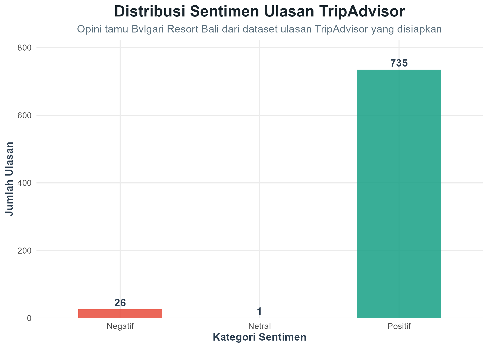

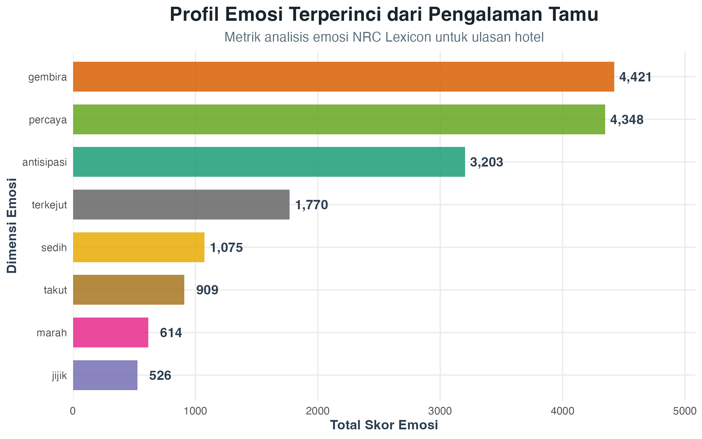

## 8. Kesesuaian Rating dan Sentimen

Rating bintang dan sentimen teks mengukur hal yang berhubungan, tetapi tidak identik. Rating adalah penilaian numerik yang padat, sedangkan teks memuat alasan, nuansa, dan kontradiksi. Karena itu, proyek menghasilkan boxplot AFINN menurut rating bintang TripAdvisor.

Grafik ini mendukung tiga pemeriksaan: apakah rating tinggi cenderung memiliki sentimen teks tinggi, apakah ada rating tinggi dengan teks rendah, dan apakah rating rendah disertai teks yang sangat negatif. Ketidaksesuaian rating-sentimen penting karena tamu dapat memberi rating tinggi tetapi tetap menulis keluhan tentang nilai, makanan, kamar, atau layanan.

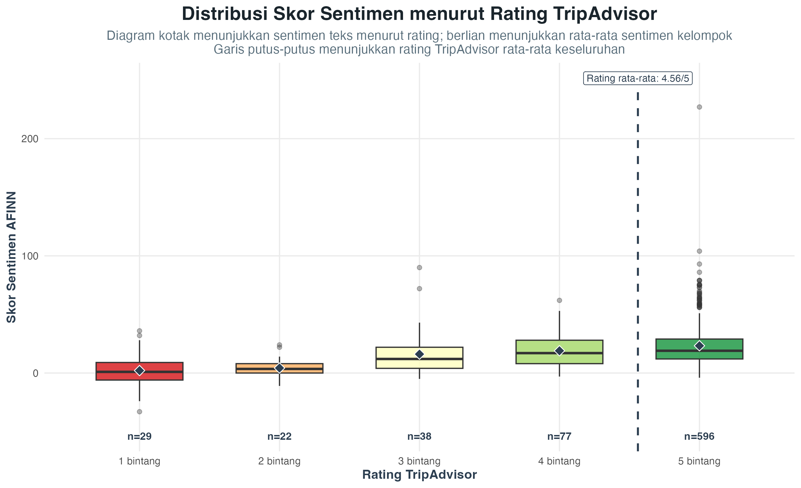

## 9. Analisis Rating Aspek

Dataset memiliki rating aspek opsional untuk value, rooms, location, cleanliness, service, dan sleep quality. Rating aspek menjadi lapisan tengah antara rating keseluruhan dan teks ulasan. Rating keseluruhan menunjukkan kepuasan umum, sedangkan rating aspek menunjukkan bagian pengalaman yang mungkin mendorong kepuasan atau ketidakpuasan.

| Aspek | Ulasan dengan rating | Cakupan | Mean | Median | Pangsa skor rendah, 1-3 |
|---|---:|---:|---:|---:|---:|
| Value | 339 | 44.5% | 4.06 | 4.00 | 25.1% |
| Rooms | 322 | 42.3% | 4.52 | 5.00 | 12.4% |
| Location | 337 | 44.2% | 4.56 | 5.00 | 11.3% |
| Cleanliness | 327 | 42.9% | 4.57 | 5.00 | 10.7% |
| Service | 440 | 57.7% | 4.67 | 5.00 | 7.7% |
| Sleep quality | 272 | 35.7% | 4.55 | 5.00 | 10.7% |

Value adalah dimensi terlemah dalam rating aspek: mean paling rendah dan pangsa skor rendah paling tinggi. Ini bukan bukti otomatis bahwa harga bermasalah, tetapi menjadi sinyal bahwa persepsi nilai perlu dibaca lebih lanjut dalam teks.

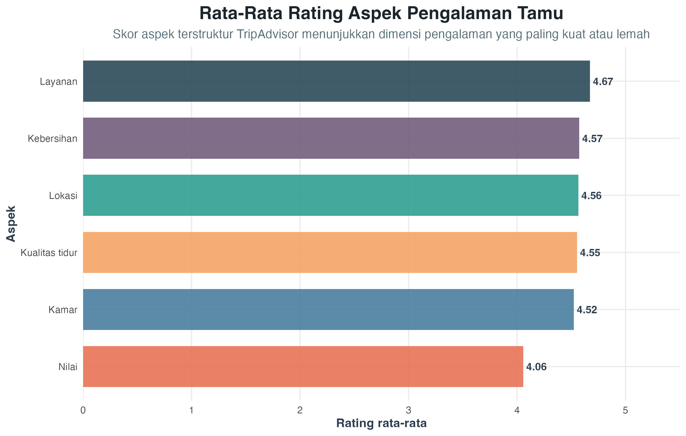

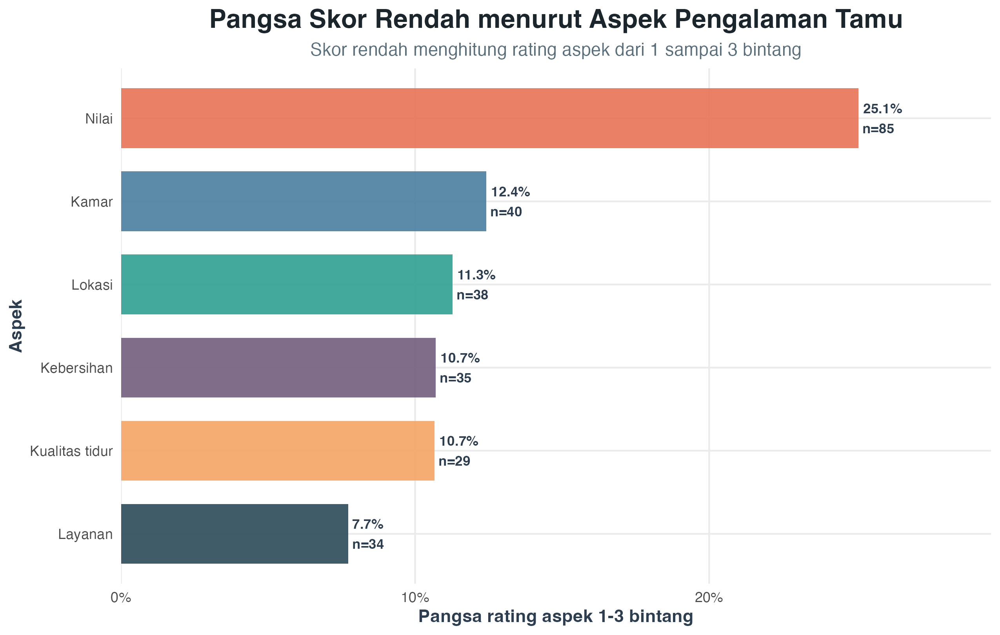

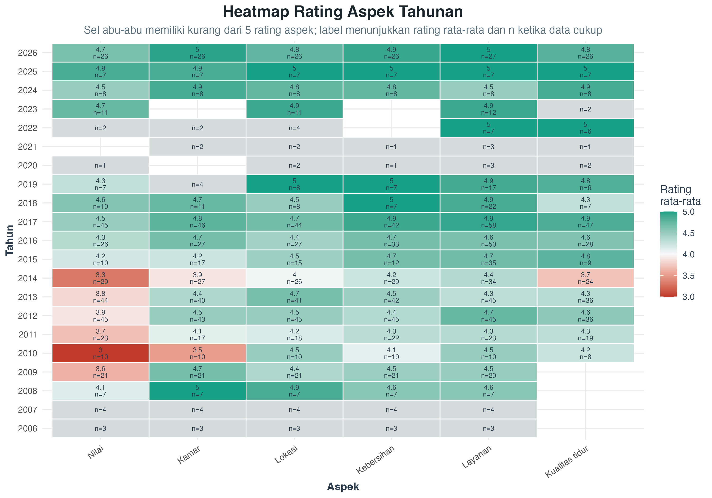

## 10. Hubungan Rating Aspek dan Teks

`05_aspect_text_analysis.R` memperlakukan rating aspek sebagai label lemah pada tingkat ulasan. Skrip membandingkan teks dari ulasan beraspek rendah dan tinggi, lalu menghasilkan ringkasan aspek, kata kunci, frasa kunci, ketidaksesuaian rating-teks, dan contoh kualitatif.

| Aspek | Mean AFINN aspek tinggi | Mean AFINN aspek rendah | Pangsa teks negatif aspek tinggi | Pangsa teks negatif aspek rendah |
|---|---:|---:|---:|---:|
| Value | 20.72 | 7.96 | 1.6% | 10.6% |
| Rooms | 18.63 | 3.25 | 2.5% | 15.0% |
| Location | 18.28 | 8.34 | 2.3% | 18.4% |
| Cleanliness | 18.55 | 3.84 | 1.7% | 22.9% |
| Service | 18.30 | 4.25 | 2.2% | 23.5% |
| Sleep quality | 19.50 | 2.86 | 2.1% | 27.6% |

Ulasan dengan rating aspek rendah memiliki sentimen AFINN yang lebih rendah dan pangsa teks negatif yang lebih tinggi pada semua dimensi. Namun, asosiasi ini tetap harus ditafsirkan hati-hati karena rating aspek berlaku untuk seluruh ulasan, bukan kalimat tertentu.

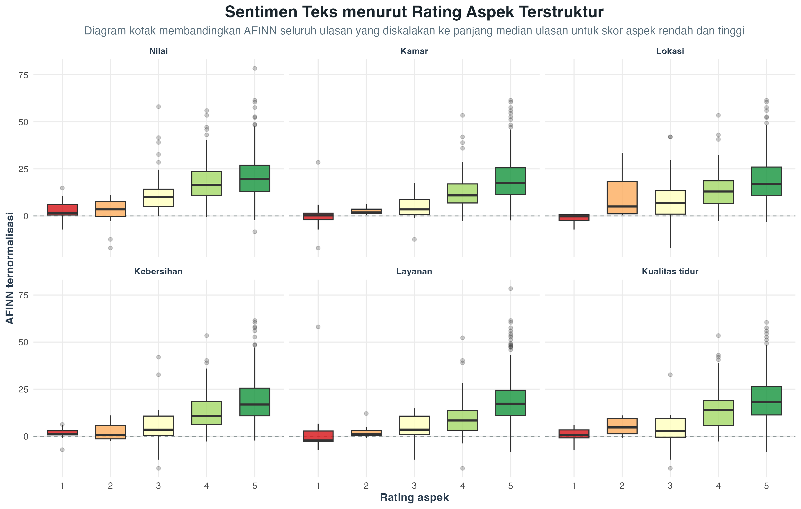

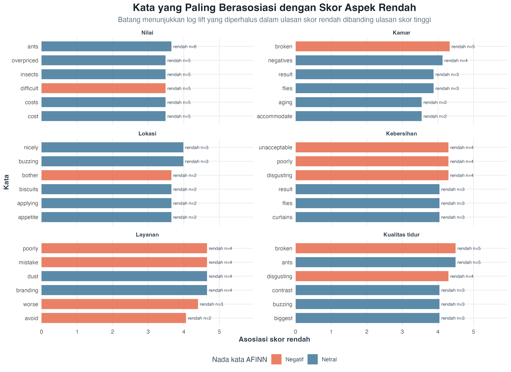

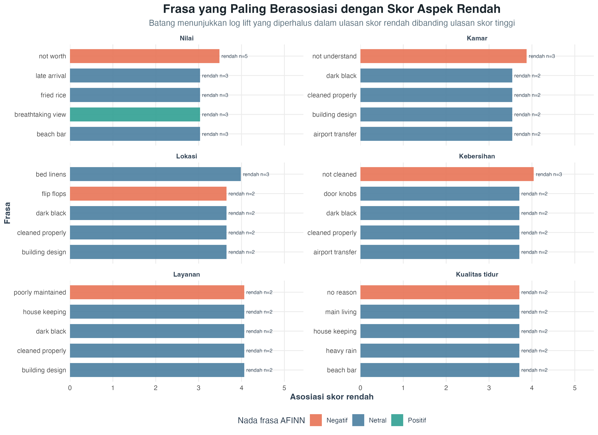

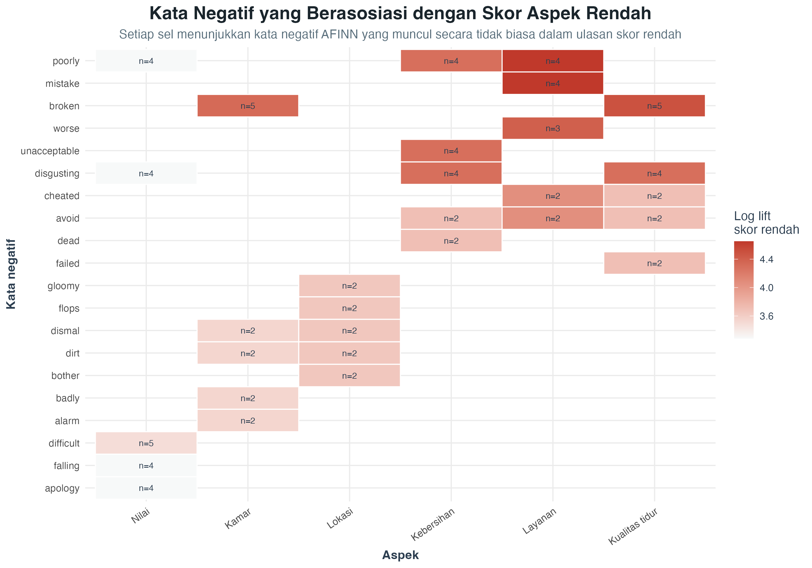

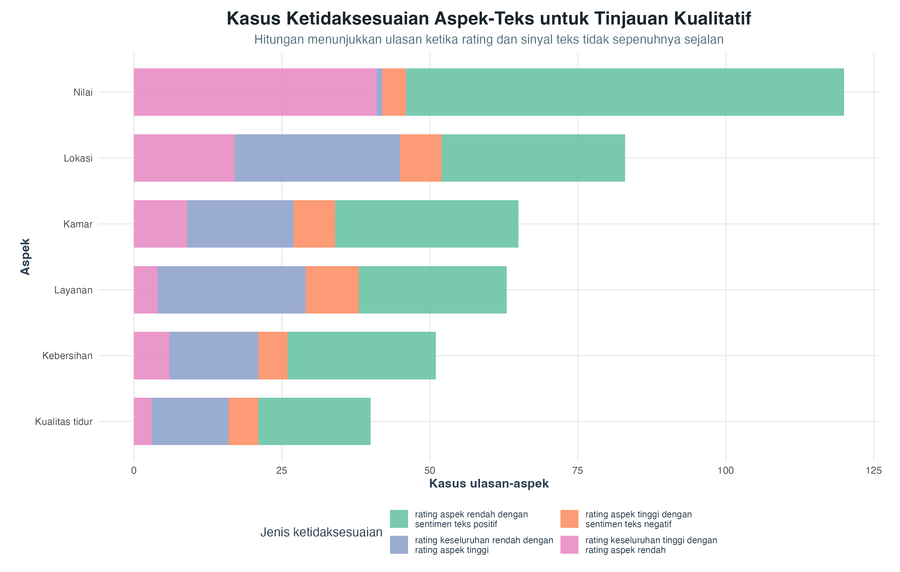

## 11. Analisis Temporal

Analisis temporal memakai beberapa panjang periode karena masing-masing menjawab pertanyaan berbeda. Bulanan berguna untuk melihat perubahan pendek, kuartalan mengurangi noise bulanan dan cocok untuk siklus operasional, sedangkan tahunan merangkum perubahan jangka panjang.

Grafik tren menggunakan skor AFINN yang dinormalisasi ke panjang ulasan median. Ini penting karena skor AFINN mentah adalah jumlah kata bersentimen, sehingga ulasan panjang dapat memiliki skor lebih besar hanya karena memuat lebih banyak kata.

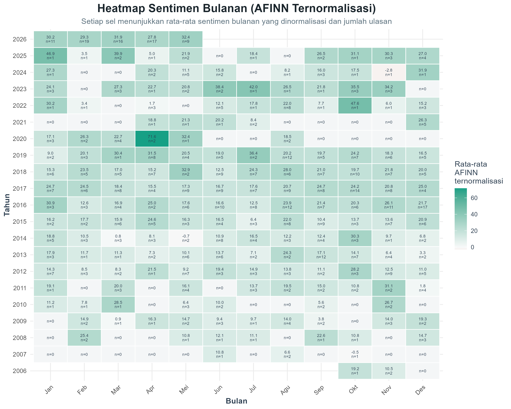

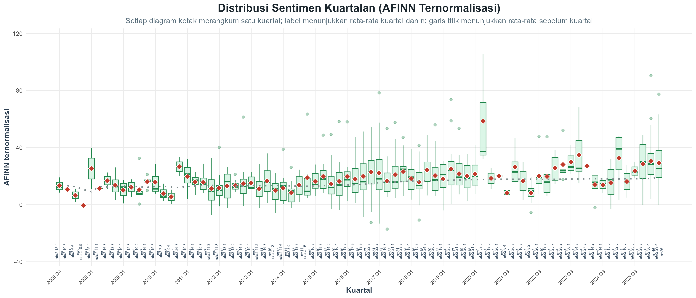

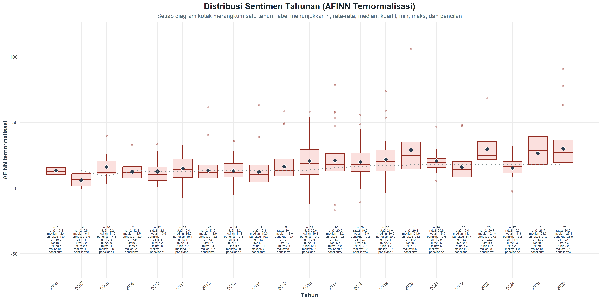

Grafik rolling bulanan memakai rata-rata bergerak enam bulan dan baseline rata-rata historis sebelumnya. Baseline tersebut hanya menggunakan ulasan sebelum periode berjalan, sehingga tidak membandingkan suatu bulan dengan data masa depan.

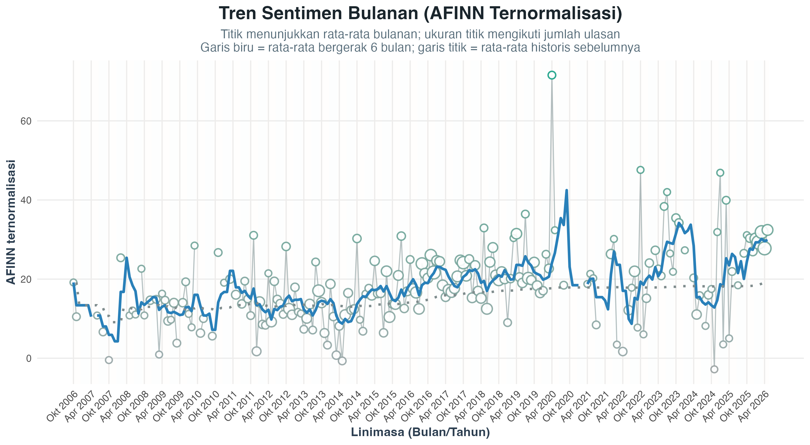

## 12. Pemantauan Drift Statistik

Proyek saat ini sudah menghasilkan output pemantauan drift statistik, tetapi belum mengimplementasikan rekomendasi manajemen atau investasi. `output/reports/sentiment_period_summary.csv` mencatat mean, median, trimmed mean, pangsa rating rendah, pangsa teks negatif, baseline historis, MAD historis, robust z-score, dan flag drift untuk bulan, kuartal, dan tahun.

Monitor memakai baseline kumulatif masa lalu: setiap periode dibandingkan hanya dengan ulasan sebelum periode tersebut. Pendekatan ini menghindari kebocoran informasi masa depan. Drift dihitung secara robust dengan median dan median absolute deviation (MAD), sehingga outlier tunggal tidak mudah menguasai baseline.

Pada aturan minimum volume dan robust-z yang saat ini diimplementasikan, tidak ada periode yang ditandai sebagai periode drift statistik. Ini harus ditafsirkan secara sempit: monitor tidak menemukan periode yang melewati ambang robust saat ini, bukan berarti properti tidak memiliki isu operasional.

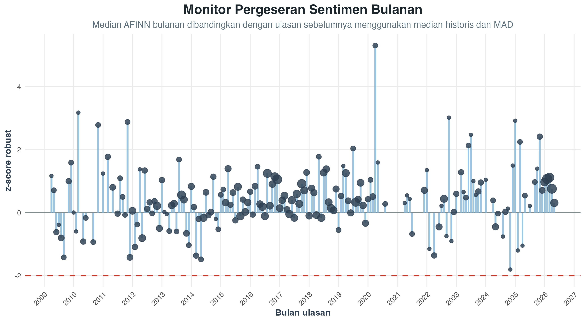

## 13. Arah Pengembangan: Dari Pola ke Tindakan

Pemetaan pola ke tindakan belum diimplementasikan dalam repositori. Arah pengembangan yang disarankan adalah membuat logika bertahap: watch, investigate, act, dan escalate. Pemicu tidak boleh berdasarkan satu fluktuasi kecil. Pemicu harus mempertimbangkan jumlah ulasan, persistensi antar periode, rating, sentimen, rating aspek, emosi negatif, dan pembacaan teks asli.

| Pola teramati | Interpretasi awal | Respons manajemen ilustratif | Respons investasi ilustratif |
|---|---|---|---|
| Rating turun dan sentimen turun | Penurunan pengalaman tamu secara luas. | Audit akar masalah dan pemulihan layanan. | Investasi terarah jika teks menunjuk aset, kamar, F&B, atau fasilitas. |
| Rating stabil tetapi sentimen turun | Bahasa ulasan mulai melemah sebelum rating turun. | Baca ulasan rating tinggi dengan teks negatif. | Lindungi pendorong pengalaman sebelum rating menurun. |
| Rating turun tetapi sentimen stabil | Potensi masalah nilai atau ekspektasi. | Tinjau komunikasi harga, paket, dan inklusi. | Investasi pada pencipta nilai yang terlihat. |
| Rating value turun | Harga atau nilai tidak terasa sepadan. | Audit inklusi, transparansi, dan ekspektasi. | Perbaiki paket atau elemen nilai sebelum diskon. |
| Service turun | Janji layanan mewah melemah. | Pelatihan, audit handoff butler, dan protokol recovery. | Investasi pada staf, pelatihan, dan retensi. |
| Rooms atau cleanliness turun | Masalah produk fisik atau housekeeping. | Inspeksi vila/kamar dan proses QA. | Prioritaskan capex, preventive maintenance, atau refurbishment. |

## 14. Reliabilitas, Validitas, Etika, dan Keterbatasan

Reliabilitas didukung oleh skrip yang dapat dijalankan ulang, konfigurasi jalur file terpusat, aturan pembersihan deterministik, dan output antara yang tersimpan. Validitas konstruk diperkuat dengan triangulasi antara rating bintang, rating aspek, sentimen AFINN, sentimen Syuzhet, emosi NRC, pola temporal, dan teks ulasan asli.

Secara etis, analisis melaporkan pola agregat dan menghindari pengungkapan individu yang tidak perlu. Ketersediaan publik tidak menghapus tanggung jawab untuk menangani narasi tamu secara hati-hati. Output analisis tidak menyimpan nama pengulas, ID profil, atau URL profil.

Keterbatasan utama penelitian adalah:

1. Pengulas TripAdvisor bersifat self-selected dan tidak mewakili seluruh tamu.
2. Rating sangat condong positif, sehingga rata-rata dapat menyembunyikan keluhan minoritas.
3. Leksikon dapat salah membaca sarkasme, idiom, negasi kompleks, bahasa campuran, dan konteks budaya (Liu, 2020).
4. Review date tidak selalu sama dengan stay date.
5. Platform dan kondisi pengambilan data dapat berubah sepanjang waktu.
6. Keputusan investasi memerlukan data okupansi, ADR, RevPAR, margin, capex, log pemeliharaan, dan data operasional lain yang tidak ada dalam korpus ulasan.

## 15. Kesimpulan

Laporan ini menunjukkan bagaimana ulasan TripAdvisor Bvlgari Resort Bali dapat diubah menjadi dataset analitis yang terstruktur. Alur kerja memvalidasi data, membersihkan teks, menghitung sentimen dan emosi, membandingkan rating dengan teks, menghubungkan aspek dengan narasi, memprofilkan geografi pengulas, memvisualisasikan tren temporal, dan menyediakan output pemantauan drift.

Prinsip utama laporan ini adalah kehati-hatian dalam membuat kesimpulan. Perubahan sentimen tidak boleh dianggap bermakna sebelum persisten, didukung volume ulasan yang cukup, ditriangulasi dengan rating atau aspek, dibaca melalui teks asli, dan dikaitkan dengan bukti operasional atau keuangan. Dengan batas tersebut, kerangka ini dapat menjadi dasar akademik dan praktis untuk analisis pengalaman tamu berbasis ulasan daring.

## Referensi

Adnyana, P. P., Wiweka, K., Lochan, A., & Trisdyani, N. L. P. (2026). Beyond taste: A sentiment analysis of informal language and cultural appreciation in Tripadvisor reviews of Balinese Ayam Betutu. *SOSIOHUMANIORA: Jurnal Ilmiah Ilmu Sosial dan Humaniora, 12*(1), 176-197. https://doi.org/10.30738/sosio.v12i1.21041

Bichler, B. F., Pikkemaat, B., & Peters, M. (2021). Exploring the role of service quality, atmosphere and food for revisits in restaurants by using a e-mystery guest approach. *Journal of Hospitality and Tourism Insights, 4*(3), 351-369. https://doi.org/10.1108/JHTI-04-2020-0048

Filieri, R., Alguezaui, S., & McLeay, F. (2015). Why do travelers trust TripAdvisor? Antecedents of trust towards consumer-generated media and its influence on recommendation adoption and word of mouth. *Tourism Management, 51*, 174-185. https://doi.org/10.1016/j.tourman.2015.05.007

Kandampully, J., & Suhartanto, D. (2000). Customer loyalty in the hotel industry: The role of customer satisfaction and image. *International Journal of Contemporary Hospitality Management, 12*(6), 346-351. https://doi.org/10.1108/09596110010342559

Litvin, S. W. (2019). Hofstede, cultural differences, and TripAdvisor hotel reviews. *International Journal of Tourism Research, 21*(5), 712-717. https://doi.org/10.1002/jtr.2298

Liu, B. (2020). *Sentiment analysis: Mining opinions, sentiments, and emotions* (2nd ed.). Cambridge University Press. https://doi.org/10.1017/9781108639286

Mohammad, S. M., & Turney, P. D. (2013). *NRC Emotion Lexicon*. National Research Council Canada. https://doi.org/10.4224/21270984

Nielsen, F. A. (2011). A new ANEW: Evaluation of a word list for sentiment analysis in microblogs. *Proceedings of the ESWC2011 Workshop on Making Sense of Microposts*, 93-98. https://doi.org/10.48550/arXiv.1103.2903

Silge, J., & Robinson, D. (2016). tidytext: Text mining and analysis using tidy data principles in R. *Journal of Open Source Software, 1*(3), 37. https://doi.org/10.21105/joss.00037
